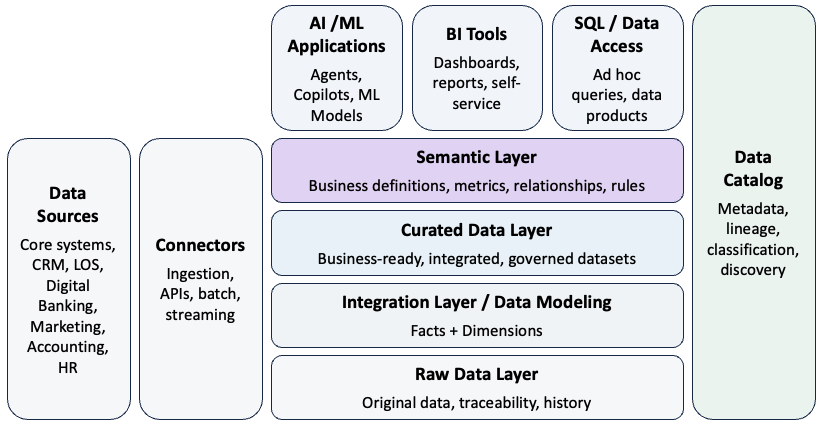
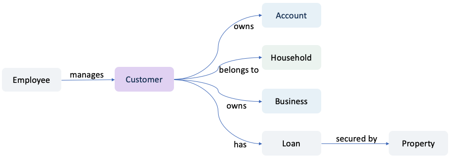
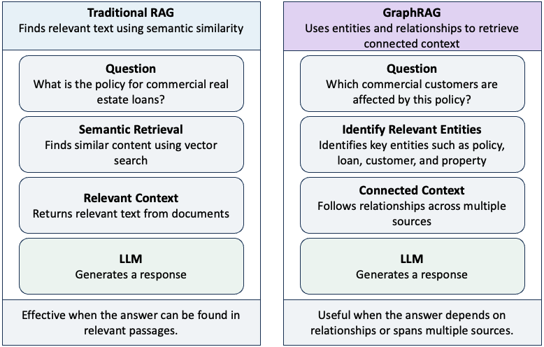
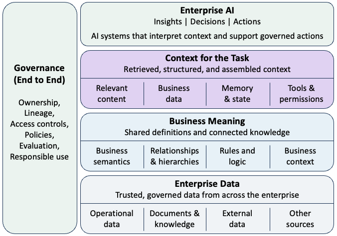

## Data Access Is Not Data Understanding

For years, enterprise data strategies have focused on making data more accessible. Organizations consolidated information into data warehouses and lakehouses, built data pipelines and APIs, and introduced self-service analytics so that more people could use data in decision-making.

Generative AI takes accessibility another step forward. Retrieval-augmented generation (RAG) allows language models to retrieve relevant information from enterprise sources, while AI agents can increasingly query databases, call APIs, and interact directly with business systems.

But access to data is not the same as understanding it. Consider a simple question at a bank: "What is the total relationship value of this customer?"

Answering it requires more than retrieving the customer's records. The system needs to understand what constitutes a *customer*, whether accounts should be aggregated at an individual or household level, which products are included in *relationship value*, how balances should be calculated, which source is authoritative, and whether the person or agent making the request is permitted to access the underlying information.

Humans often resolve these questions using institutional knowledge. An experienced analyst knows which definitions to use, which systems to trust, and which business rules apply. An AI system cannot be expected to infer those meanings reliably from raw data alone.

This is the emerging challenge for enterprise AI: making business meaning as accessible to machines as the underlying data itself.

## What Is a Semantic Layer?

A semantic layer sits between enterprise data and the people and systems that use it. Its purpose is to translate technical data structures into consistent, machine-readable business meaning.

Traditionally, semantic layers have been associated with business intelligence. They provided common definitions for measures such as revenue, customer count, deposits, or profitability so that different reports did not calculate the same metric differently.

For AI, however, the concept needs to be broader. A semantic layer can organize enterprise data around business concepts and make their meaning explicit. Depending on the architecture, it can incorporate business definitions, metrics, relationships, rules, and governed access to data.

{fig-align="center" width="100%"}


Consider a bank's underlying data. These fields tell a system what data exists, but not necessarily what that data means in a business context:

```text
CUSTOMER_ID = 58291
PRODUCT_CD  = DDA
BALANCE     = 250,000
BRANCH_CD   = 104
```

A semantic layer can make that meaning explicit:

```text
CUSTOMER_ID → Customer
DDA         → Demand Deposit Account
BALANCE     → Current Deposit Balance (governed business rule)

Customer → owns → Account
Account  → serviced by → Branch
Customer → belongs to → Household
```

The first representation exposes data. The second gives that data business meaning.


## Why AI Raises the Stakes

The importance of semantic consistency increases as AI moves from answering questions to making decisions and taking actions. Consider an agent asked to identify customers eligible for a particular offer. The underlying data may be accurate, but the result can still be wrong if the agent uses the wrong definition of customer, evaluates eligibility at the individual rather than household level, includes the wrong products, or applies the wrong business rules. The issue is not simply whether AI has access to the right data. It is whether the system interprets that data within the right business context.

This becomes more consequential as AI moves closer to action:

```text
Traditional Analytics

Data → Analyst → Interpretation → Decision


Agentic AI

Data → AI Interpretation → Decision → Tool → Action
```

Semantic consistency therefore becomes more than a data-management concern. It becomes part of the control environment for enterprise AI. Business meaning, however, extends beyond definitions and rules. Enterprise knowledge is also deeply relational.

## Knowledge Graphs: Making Relationships Explicit

A customer owns accounts, belongs to a household, may own a business, has loans secured by collateral, and interacts with employees. A knowledge graph makes relationships such as these explicit by representing business concepts as entities and the connections among them as relationships.

{fig-align="center" width="100%"}

Knowledge graphs can complement the semantic layer by making relationships among business concepts explicit and machine-readable. A useful distinction is that a semantic layer helps define what business concepts mean and how they should be interpreted, while a knowledge graph helps represent how those concepts are connected.

For example, a semantic layer might define what *customer*, *deposit balance*, or *household* means and which rules govern their use. A knowledge graph can represent which accounts a customer owns, which household the customer belongs to, which businesses the customer is connected to, and how customers, loans, and properties are related.

This becomes important when AI needs to answer questions that depend on relationships, paths, and connected information, rather than simply finding a relevant document.

## GraphRAG: Retrieving Connected Context

Traditional RAG typically retrieves information based on semantic similarity. This works well when the answer can be found in relevant passages, but enterprise questions are not always similarity problems.

Consider:

> **Which commercial customers have loans secured by properties affected by this policy change, and who manages those relationships?**

The answer may not exist in any single document or database record. It may require connecting a policy to applicable loan types, loans to collateral, collateral to customers, and customers to relationship managers.

This is where GraphRAG becomes useful. GraphRAG combines retrieval-augmented generation with graph-structured knowledge, allowing retrieval to incorporate entities and relationships rather than relying only on semantically similar content.

The distinction can be simplified as:

{fig-align="center" width="100%"}

The approaches are complementary rather than competing. Semantic retrieval is effective when relevant information can be found in documents or passages. Graph retrieval becomes useful when answering a question requires traversing entities, relationships, paths, or information distributed across multiple sources.

In practice, an enterprise architecture may use both vector and graph retrieval to construct context for the model.

The objective is not simply to retrieve information that resembles the question. It is to construct the right context for the task.


## Context Engineering: Building the Right Context for AI

RAG and GraphRAG address an important question: How do we retrieve information relevant to a task? But retrieval is only one part of what an AI system needs.

An enterprise agent may require business definitions from a semantic layer, connected knowledge from a knowledge graph, structured data from operational systems, relevant documents, memory, policies, tools, permissions, and the current state of a workflow.

The challenge is therefore broader than retrieval. Context engineering determines what information and capabilities an AI system needs for a particular task and assembles them into usable context.

More context is not necessarily better. Excessive or irrelevant information can increase cost and latency, obscure relevant information, and introduce conflicts. The objective is to provide the right context for the task.

Each component contributes something different:

- **Semantic layer** — What does this information mean?
- **RAG** — What information is relevant?
- **Knowledge graph** — How are these things connected?
- **Memory** — What should the system remember?
- **Tools** — What can the agent do?
- **Permissions and policies** — What is the agent allowed to do?

Context engineering goes beyond retrieving information. It is the discipline of assembling the information, meaning, capabilities, and constraints an AI system needs for a particular task.

As AI moves from answering questions to performing work, engineering the right context becomes part of building the AI system itself.

## The Emerging Enterprise AI Context Architecture

Context engineering addresses what an AI system needs for a particular task. At enterprise scale, a broader question emerges: How should organizations provide that context consistently, securely, and with appropriate governance? At enterprise scale, AI needs a governed path from data to meaning to context.

{fig-align="center" width="80%"}

That path does not require every AI application to use every component. A policy assistant may work well with conventional RAG. An analytics assistant may rely primarily on governed metrics and structured data. A use case involving complex relationships may benefit from a knowledge graph and GraphRAG. The architecture should be shaped by the task.

What matters is that the path from enterprise data to AI context remains governed. Business definitions need ownership. Sources need authority and lineage. Context needs appropriate access controls. Retrieval needs evaluation. And the information supplied to an AI system needs to remain consistent with the permissions and policies governing the underlying data.

As AI systems become more autonomous, the quality of their decisions and actions will depend not only on the intelligence of the model, but also on the quality of the context architecture surrounding it.

The semantic layer therefore becomes part of a broader foundation for enabling AI systems to interpret enterprise data within the context in which it is used.

## Conclusion: Business Meaning as AI Infrastructure

Enterprise AI is making organizational knowledge increasingly accessible. But access alone does not create understanding.

As AI moves from answering questions to making decisions and taking actions, organizations need machine-readable definitions, relationships, rules, and context. The semantic layer therefore becomes more than an analytics abstraction—it becomes part of the foundation for how enterprise AI interprets and uses business information.

The enterprise AI challenge is no longer simply making data accessible. It is making business meaning machine-readable.
